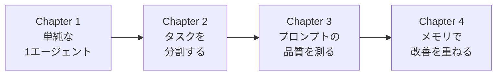

# Mastra エージェント チュートリアル

技術ブログ記事を自動生成するエージェントシステムを、段階的に作りながら学ぶハンズオンです。

## このチュートリアルで学べること

- エージェント開発で避けて通れない**タスク分割の難しさ**
- プロンプトの品質がアウトプットに与える影響を**数値で比較**

---

## セットアップ

```bash
npm install
```

### OpenAI版

```bash
cp .env.example .env
# .env ファイルを開いて OPENAI_API_KEY を設定してください
```

### AWS Bedrock版（SageMaker Studio等）

`.env` ファイルは不要です。IAM Roleで認証されます。

**使用モデル**: Amazon Nova Lite（入力: $0.06/1M tokens, 出力: $0.24/1M tokens）

---

## チュートリアルの流れ



---

### Chapter 1: 「全部やって」の落とし穴

```bash
# OpenAI版
npm run ch1

# Bedrock版
npm run ch1:bedrock
```

**何を体験するか**
- 1つのエージェントに記事全体を任せると、どんな問題が起きるか
- 同じ指示でも、毎回違う結果が返ってくる不安定さ
- 「どこを直せばいいのか」が分からない状態

---

### Chapter 2: タスクを分割して設計する

```bash
# OpenAI版
npm run ch2

# Bedrock版
npm run ch2:bedrock
```

**何を体験するか**
- `research → outline → write → review` のワークフロー設計
- **分割の本質的な難しさ**: 「どこで切るか」より「何を渡すか（スキーマ設計）」が重要
- 最初のステップ（research: リサーチ）の品質が、後続すべてに影響する問題
- 間違った分割の例: 「前半を書く → 後半を書く」（文脈が途切れてしまう）

**ワークフローの流れ**
```
researchStep (リサーチ)  → { keyPoints[], targetAudience, tone }
  ↓
outlineStep (構成設計)   → { sections[], targetAudience, tone }
  ↓
writeStep (執筆)        → { draft, targetAudience }
  ↓
reviewStep (レビュー)    → { revisions[], article }
```

---

### Chapter 3: プロンプトの品質を測る

```bash
# OpenAI版
npm run ch3

# Bedrock版
npm run ch3:bedrock
```

**何を体験するか**
- 3つのパターンを同じ評価基準で比較し、スコアの違いを確認する

| パターン | instructions | リクエスト | 期待スコア |
|---|---|---|---|
| A（最悪）| 「記事を書いてください」 | 「TypeScriptについて」 | 低 |
| B（中程度）| 詳しい役割設定あり | トピックのみ | 中 |
| C（最良）| 詳しい役割設定あり | 対象読者・構成・トーン指定あり | 高 |

**評価の観点**
- `指示準拠スコア`: instructions の要件をどれだけ守っているか
- `コンテンツ品質`: 構成・深さ・具体性・読者への適切さの総合評価

---

### Chapter 4: メモリで改善を重ねる

```bash
# OpenAI版
npm run ch4

# Bedrock版
npm run ch4:bedrock
```

**何を体験するか**
- メモリなし: 「もっと初心者向けに書き直して」 → 前の記事を忘れて一から生成
- メモリあり: 同じ `thread` で送ると前の記事を覚えていて、差分だけで修正できる

```typescript
// thread と resource で会話を識別
await agent.generate("初稿を書いて", {
  memory: { thread: "article-session-1", resource: "user-1" }
});

// 同じ thread なので前の記事を覚えている
await agent.generate("もっと初心者向けに書き直して", {
  memory: { thread: "article-session-1", resource: "user-1" }
});
```

---

## このチュートリアルで伝えたいこと

### タスク分割の本質的な難しさ

エージェント開発で「タスクを分割する」というと、多くの人は「どこで切るか」を考えます。
例えば「記事を書く」を「前半を書く → 後半を書く」のように分割するイメージです。

しかし、本当に難しいのは**「次のステップに何を渡すか」を設計すること**です。

```typescript
// ❌ 悪い例: 何を渡すか曖昧
researchStep → outlineStep
// 何が渡されるか分からない

// ✅ 良い例: スキーマで明確に定義
researchStep → { keyPoints[], targetAudience, tone } → outlineStep
// 次のステップが必要とする情報が明確
```

スキーマ設計を間違えると、後続のステップが「必要な情報が足りない」状態になり、
いくらプロンプトを調整しても品質が上がりません。

**Chapter 2で体験すること**: 最初のステップ（research）の出力スキーマが不十分だと、
後続の outline → write → review すべてが影響を受けてしまう問題。

---

### プロンプトの品質とアウトプットの関係

プログラミングでは、間違ったコードを書くと「エラー」が出ます。
しかし、エージェントに曖昧な指示を出しても**エラーにはなりません**。

代わりに「低品質なアウトプット」が返ってきます。

```typescript
// ❌ 曖昧な指示 → エラーにならないが品質が低い
"記事を書いてください"
→ 毎回違う構成、対象読者が不明確、トーンがバラバラ

// ✅ 明確な指示 → 安定した高品質なアウトプット
{
  topic: "TypeScript",
  targetAudience: "JavaScript経験者でTypeScriptは初めての人",
  tone: "丁寧で具体例が多い",
  structure: ["基本概念", "実践例", "よくある間違い"]
}
→ 期待通りの記事が生成される
```

この「曖昧さがエラーにならない」特性が、エージェント開発を難しくしています。

**Chapter 3で体験すること**: 同じエージェントでも、インプットの品質によって
アウトプットのスコアが大きく変わることを数値で確認します。

**ワークフローとの関係**: ワークフローの `inputSchema` を丁寧に設計することが、
実は最良のプロンプトエンジニアリングになります。スキーマが「良いインプットを強制する装置」として機能するからです。

---

## 使用しているパッケージ

| パッケージ | 用途 |
|---|---|
| `@mastra/core` | Agent, createTool, createWorkflow, createStep, createScorer |
| `@mastra/memory` | Memory クラス（Chapter 4で使用） |
| `@mastra/libsql` | インメモリ SQLite ストレージ（Chapter 4で使用） |
| `@mastra/core/evals` | createScorer など（Chapter 3で使用） |
| `zod` | スキーマ定義（全章で使用） |
